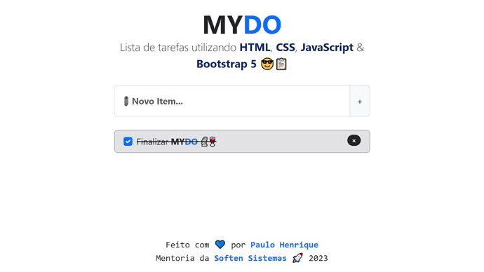
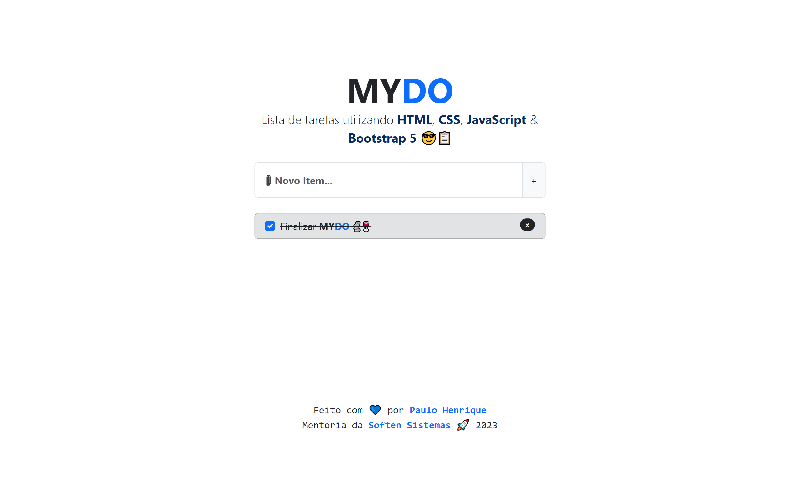
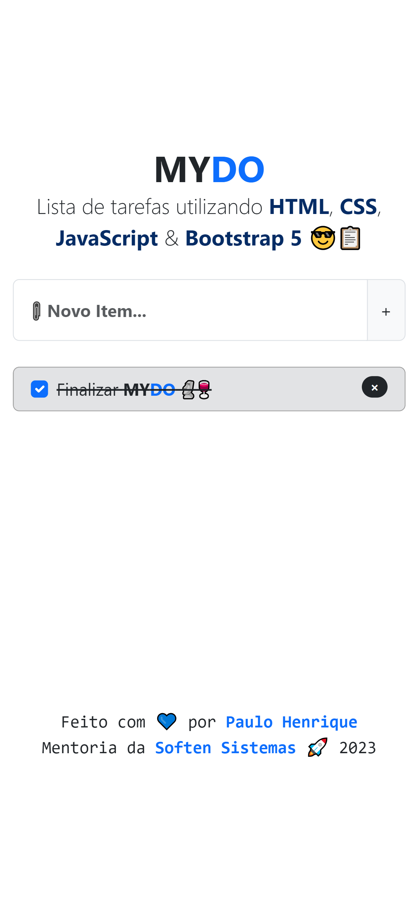

# MyDO v1.0 - Lista de Tarefas
Este projeto foi desenvolvido com o objetivo de aplicar conceitos básicos de desenvolvimento web durante a mentoria da [Soften Sistemas][link_soften_sistemas] em 2023. O aplicativo de lista de tarefas foi desenvolvido utilizando [HTML][link_html], [CSS][link_css], [JavaScript][link_javascript] e [Bootstrap 5][link_bootstrap5]. 

| Visão Geral |
|----------|
||

| Desktop | Mobile |
|----------|----------|
|||

A aplicação foi desenvolvida com responsividade, tornando-a compatível tanto com dispositivos desktop quanto móveis. Ela oferece recursos que permitem salvar as tarefas no 'localStorage' e adicionar novas tarefas de forma ágil utilizando a tecla 'ENTER' do teclado.

- Adiciona e remove tarefas
- Marca tarefas como concluídas
- Salva tarefas no 'localStorage'
- Responsivo para desktop e mobile
- Adiciona tarefas com a tecla de atalho 'ENTER'

[link_soften_sistemas]: <https://www.softensistemas.com.br/>
[link_html]: <https://www.w3schools.com/html/default.asp>
[link_css]: <https://www.w3schools.com/css/default.asp>
[link_javascript]: <https://www.w3schools.com/js/default.asp>
[link_bootstrap5]: <https://getbootstrap.com/docs/5.3/getting-started/introduction/>